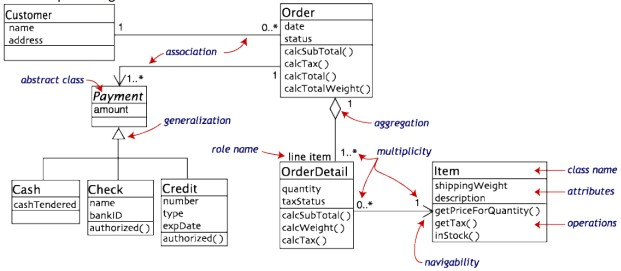

# Eksamensnotater 2019
by Sondre Lindaas Gjesdal
## Different types of software development models
* Waterfall
    * Linear production flow, outdated
* Agile development
    * Letting the client side in on the development process. Possible to go back and forth
    * Adaptable to changes
* Kanban
    * Using a Kanban board to get a better overview and make it easier to focus on the task at hans
    * Popular in SCRUM
* SCRUM
    * 2-4 weeks of highly focused sprints focusing on very specific goals
* LEAN
    * Designed for fast delivery & minimum waste

## Waterfall

Waterfall is a linear way of developing and is therefor not particularly iterative and flexible.
The progress flows mostly in one direction through the six stages.

* Requirements
    * Captured in a product requirements document
* Analysis
    * Resulting in models, schema, and business rules
* Design
    * Software architecture
* Coding
    * The development, proving and integration of software
* Testing
    * Systematic discovery and debugging of defects in the software
* Operations
    * the installation, migration, support and maintenance of complete systems

This model is from an 1970 article by [Winston W. Royce](https://en.wikipedia.org/wiki/Winston_W._Royce).

Unmodified waterfall model 

##### Supporting Arguments
The linear development reduces cost at later stages of the development. As there is no need to fix
problems before the end of the development.

Another bonus is the requirements for documentation necessary as well as source code. This makes the loss
of a team member easier to recover from other methods that doesn't have that much emphasis on
documentation and therefor a lot of knowledge lost. The waterfall model provides a structured approach
as the model itself progresses linearly through easy to explain phases and is thus easy to understand.
Because of this it's a first example of software engineering texts and courses.

##### Criticism
Clients might not know exactly what their requirements are before they see a working software and are thus
often changed in the middle of development and towards the end. Leading to redesign and redevelopment.
Something that increases cost.

Designers are not always aware of the difficulties ahead when designing a new feature or product.
Which the can lead to revising of design.

## Fusion

##### Short
The method integrates and extends the best features of earlier OO methods. It's a full
coverage method, providing a direct route from requirements definition through analysis and design
to a programming language implementation. 

##### Key attributes for EVO

1. Multiobjective driven
2. Early, frequent iteration
3. Complete analysis, design, build, and test in each step
4. User orientation
6. Systems approach, not merely algorithm orientation
5. Open-ended basic systems architecture
7. Result orientation, not software development process orientation

## RUP

Rational Unified Process divides the development process into four distinct phases that each involve
business modeling, analysis and design, implementation, testing and deployment. RUP development methodology 
provides structured way for companies to envision create software programs. Since it provides a 
specific plan for each step of the development process.

RUP is a process product, developed and maintained by Rational Software. The development team for RUP are working
closely with customers, partners, Rational's product groups as well as Rational's consultants organization, to ensure
that the process is continuously updated and improved upon to reflect recent experiences and evolving and proven best
practices.

#### Phases
1. Inception
    * Idea for the project is stated. Dev team determines if the project is worth pursuing and what
    resources are needed.
    * Stakeholders concurrence on scope definition and cost/schedule estimates.
    * Requirements understanding as evidence by the fidelity of the primary use cases.
    * Credibility of the cost/schedule estimates, priorities, risks, and dev process.
    * Depth and breadth of any architectural prototype that was developed.
    * Establishing a baseline by which to compare actual expenditures vs planned expenditures.
2. Elaboration
    * Project architecture and required resources are further evaluated. Devs consider possible application
    of the software and costs associated with the development.
3. Construction
    * Project is developed and completed. The software is designed, written and tested
4. Transition
    * Software is released to the public Final adjustments and updates are made based on feedback from end 
    users
  
#### Business modelling
* Opprette en bedre forståelse og kommunikasjon mellom forretnings
utviklere og software utviklere.
* Forstå strukturen og dynamikken til forretningen/organisasjonen/interessenten
som skal bruke systemet.
* Finne nåværende problemstillinger og mulige forbedringer.

#### Requirements
* Beskrive hva systemet skal gjøre.
* Lage et Bruksmønster Diagram.

#### Analysis and Design
* Skal vise korleis systemet vil bli realisert i gjennomføringsfasen
* Resultere i eit design og analyse modell.

#### Implementation
* Implementere klasser og objekter i systemet.
* Teste og utvikle komponenter til systemet.
* Sette sammen de ulike delene til et system.

#### Test
* Bekrefte interaksjoner mellom objekter.
* Bekrefte riktig integrasjon av alle komponenter i systemet
* Bekrefte at alle behovene i systemet er implementert riktig.
* Finne og identifisere feil i systemet og korrigere disse før utviklingsfasen

#### Deployment
* Produsere ein produktutgivelse
* Distribuere produktet til interresenter
* Drive support for produktet

#### Configuration and Change Management
* Konfigurasjonsledelse.
* Forandringsforespørsel ledelse.
* Status og mål ledelse.

#### Project Management
* Risiko behandling
* Planlegging av prosjektet.
* Overvåking av prosessens utvikling.

#### Environment
* Beskrive aktivitetene som er nødvending for utviklingsprosessen.
* Forberede prosjekt-spesifikke midler.
* Lage ein utstyrsliste over nødvendig utstyr til prosjektet.

## Agile

#### What's Agile?
Agile is the ability to create and respond to change. It's a way to overcome
an uncertain and turbulent environment. Authors of the Agile Manifesto chose "Agile"
as the label for the idea because the word represented the adaptiveness and response
to change which was so important to their approach.

It's about understanding the your environment today and what uncertainties you're
facing and figure out how to adapt to what's going on.

#### Agile Software Development
Agile is an umbrella term for a set of frameworks and practices
based on the values and principles expressed in the [Agile Manifesto](https://www.agilealliance.org/agile101/the-agile-manifesto/)
and the 12 Principles.

Agile focuses on the people doing the work and how they work together. 
Solutions evolve through collaboration between self-organizing cross-functional teams.

Self-organizing teams is a big focus in Agile development as in they can figure
out how they're going to approach things on their own.
It means the teams are cross-functional. So there is no need for specific
roles. This is because the managers make sure team members have, or obtain, 
the right skill sets. Managers provide the environment that allows the team to 
be successful. 

#### 12 principles

1. Our highest priority is to satisfy the customer through early and continous 
delivery of valuable software.
1. Welcome changing requirements, even late in development. Agile processes 
harness change for the customer's competitive advantage.
1. Deliver working software frequently, from a couple of weeks to a couple of months, with a preference
 to the shorter timescale.
1. Business people and developers must work together daily throughout the project
1. Build projects around motivated individuals. Give them the environment and support
they need, and trust them to get the job done.
1. The mos efficient and effective method of conveying information to and within a development
team is face-to-face conversation.
1. Working software is the primary measure of progress.
1. Agile processes promote sustainable development. The sponsors, developers, 
and users should be able to maintain a constant pace indefinitely.
1. Continuous attention to technical excellence and good design enhances agility.
1. Simplicity -- The art of maximizing the amount of work done -- is essential
1. The best architectures, requirements, and designs emerge from self-organizing teams.
1. At regular intervals, the team reflects on how to become more effective,
then tunes and adjusts its behavior accordingly.

## UML

Unified Modeling Language is a standardized general-purpose modeling language in the field of OO software engineering.
While a set of diagrams is partial graphic representation of a system's model, which also contains documentation that 
drives the model the model elements and diagrams, the UML diagrams represent two different views of a system model.

##### Static/structural view
Emhasizes the dynamic behavio of the system by showing collaborations among objects and changes to the internal 
states of objects. Ex: Class diagram, Composite Structure diagram.
##### Dynamic/behavioral view
Emphasizes the dynamic behavior of the system by showing collaborations among objects and changes to the 
internal states of objects. Ex: Sequence diagram, Activity diagram, State Machine diagram.

### Structure Diagrams
#### Class Diagram
Describes the structure of a system by showing the system's classes, their attributes, and the relationships among
the classes.

#### Component Diagram
Describes how a software system is split-up into components and shows the dependencies among these components.

#### Deployment Diagram
Describes the hardware used in system implementations and the execution environments and the artifacts 
deployed on the hardware.

#### Object Diagram
Shows a complete or partial view of the structure of an example modeled system at a specific time.

#### Package Diagram
Describes how a system is split-up into logical groupings by showing the dependencies among these groupings.

### Behaviour Diagrams
#### Activity Diagram
Describes the business and operational step-by-step workflows of components in a system. An diagram shows 
the overall flow of control.

#### State Machine Diagram
Describes the states and state transitions of the systems.

#### Use Case Diagram
Describes the functionality provided by a system in terms of actors, their goals represented as use cases, 
and any dependencies among those use cases
 

### Interaction Diagrams
#### Communication Diagram 
Shows the Interactions between objects or parts in terms of sequenced messages. They represent a combination of
information taken from Class, Sequence and Use Case Diagrams describing bot the static structure and dynamic
behavior of a system.

#### Sequence Diagram
Shows how objects communicate with each other in terms of a sequens of messages. Also indicates the lifespans
of objects relative to those messages.
  

## Software Architecture

## KISS

KISS is an acronym for "Keep it simple, stupid". It's a design principle noted by US Navy in 1960. The KISS principle
states that most systems work best if they are kept simple rather than complicated. Therefor simplicity should be
a key goal in design.

## GRASP
General Responsibility Assignment Software Patterns consist of guidelines for assigning responsibility to classes
and objects in OO design. It is not connected to SOLID design principle. The patterns and principles in GRASP are
controller, creator, indirection, information expert, high cohesion, low coupling, polymorphism.

#### Controller
Controller pattern assigns the responsibility of dealing with system events to a non-UI class that 
represents the overall system or a use case scenario. So a controller is a non user interface object responsible for 
receiving or handling a system event

#### Creator
The class creating objects is called a creator. Which class that is, is a fundamental property of the relationship
between objects of particular classes.

more should be written here about responsibility of creating objects

#### Indirection
Indirection supports low coupling and reuse potential between two elements by assigning the responsibility
of mediation between them to an intermediate object. An example of this is the introduction of a controller component
for mediation between data and its representation in the model-view control pattern. 
This ensures that coupling between them remains low.

#### Information Expert
A principle used to determine where to delegate responsibilities such as methods, computed fields, and so on.
Using the principle of information expert, a general approach to assigning responsibilities is to look at a given
responsibility, determine the information needed to fulfill it, and then determine where that information is stored.
This will lead to placing the responsibility on the class with the most information required to fulfill it.

#### High Cohesion
High cohesion is a patterns that attempts to keep objects appropriately focused, manageable and understandable. 
It's used in support of low coupling. High cohesion means that the responsibilities of a given elements are 
strongly related and highly focused.

#### Low Coupling
Coupling is a measure of how strongly one element is connected to, has knowledge of, or relies on other elements. 
Low coupling is an evaluative pattern that dictates how to assign responsibilities to support
* Lower dependency between the classes,
* Change in one class having lower impact on other classes,
higher reuse potential.

#### Polymorphism
According to the polymorphism principle, responsibility for defining the variation of behaviors based on type
is assigned to the type for which this variation happens. The user of the type should use polymorphic operations 
instead of explicit branching based on type.

#### Protected variations
The pattern protects elements from the variations on other elements by wrapping the focus of instability with an
interface and using polymorphism to create various implementations of this interface. 

#### Pure Fabrication
A pure fabrication is a class that does not represent a concept in the problem domai, specially made up to achieve low
coupling, high cohesion, and the reuse potential thereof derived. This kind of class is called a "service" in 
domain-driven design.

## SOLID
Solid is a mnemonic acronym for five design principles intended to make software designs more understandable, 
flexible and maintainable. It is not related to GRASP software design principles. It's a subset of many principles.
Though they apply to any OO design, SOLID principles can also form a core philosophy for methodologies such as agile dev
and adaptive software development. Introduced by Robert C. Martin in *Design Principles and Design Patterns*, The 
acronym was introduced later by someone else.

#### Single responsibility
A class should have only a single responsibility, that is, only changes to one part of the software's specification
of the class

#### Open-close
"Software entities ... should be open for extension, but closed for modification"

#### Liskov substitution
"Objects in a program should be replaceable with instances of their subtypes without altering the 
correctness of that program"

#### Interface segregation
"Many client-specific interfaces are better than one general-purpose interface"

#### Dependency inversion
One should "depend upon abstractions, [not] concretions." 

## Manifesto for Agile programming

**Individuals and interactions** over processes and tools

**Working software** over comprehensive documentation

**Customer collaboration** over contract negotiation

**Responding to change** over following a plan

That is while there is value in the items on the right, we value the items on the left more.

## Extreme programming (XP)

XP is one of several popular Agile processes. It's proven successful at many companies of all sizes.
XP stresses customer satisfaction and that's one of the reasons it's so successful. Instead of delivering all in one,
XP delivers the software you need when you need it. XP empowers confident responding to changing customer requirements,
even late in the lifecycle.
Managers, customers and devs are all equal partners in a collaborative team. XP implements simple and effective
environment, enabling teams to become highly productive. Team self organize around the problem to solve it as 
effectively as possible.

XP improves software projects in five essential ways:
* Communication
* Simplicity
* Feedback
* Respect
* Courage

Constant communication between customers and fellow programmers. Always keeping their design simple and clean.
They get feedback by testing, starting day one. Early deliveries to customer and implementing suggested changes.
XP has [simple rules](http://www.extremeprogramming.org/rules.html).
XP has many small pieces that individually doesn't make sense, but combined a complete picture can be seen.
The rules set expectation between team members but are not the end goal.

### XP flow chart

![XP flow chart](Pictures/XP.jpg

## SCRUM Guide

SCRUM is a framework that makes addressing complex and adaptive problems possible. At the same time we creatively and 
efficiently deliver a product with highest possible value.

SCRUM is:
* Lightweight
* Easy to understand
* Especially hard to master
 
 Been used for complex software development since the early 90's. 
 
 ### Scrum usage
 Areas of which Scrum has been used: 
 1. Mapping and identifying the marked, technology and product properties.
 2. Development of new products, as well as product expansions.
 3. Putting products and expansions in production.
 4. Develop cloud services and other operational environments.
 5. managing and updating products.
 
 Scrum especially efficient in iterative and incremental sharing of experience. The core in Scrum is a small team that's
 very flexible and adaptable.
 
 ### Theory behind Scrum
 Scrum is based on empiricism, which is the theory of knowledge coming from experience and making decisions
 based on what's known. 
 
 The three pillars in empirical procession:
 * Transparency
 * Inspection
 * Adaption
 
   
### Scrum team

The team consists of a Product owner, Development team and Scrum Master. The Scrum team is self-organizing and cross
functional. Scrum teams has shown to increase efficiency over time. They deliver the product iteratively and 
incrementally. This maximizes the possibility of feedback.

#### Product owner
Responsible for maximizing the value of the product as a result of the work the dev team does. 

Product owner is the only one responsible for the product backlog. Handling the backlog consists of:

* Clearly expressing backlog elements
* Order backlog elements for efficiently reaching objectives
* Optimizing value of work done by dev team
* Make sure the backlog is visible, transparent and clear to all, as well as showing Scrum team what to work 
on in next sprint.
* Make sure dev team has the necessary understanding of elements in the backlog.

  
  
#### Development team(dev team)
Dev team consists of professionals doing the necessary work for delivering a potentially product increment at the end
of each sprint. Dev team is handed responsibility of the organization to organize thyself to do their work.

Dev team has the following characteristics:
* Self organizing, no one tells them how they're supposed to make backlog elements to delivery ready functionality.
* Dev team are cross-functional, got all the necessary experience to make a product increment
* In a Scrum dev team there's only developers. despite of the work the person does.
* Dev team does not contain subgroups, independent of what domainknowledge which is needed,
ex: tests, architecture, operations and so on
* Individuals in dev team can have specialized in things, and domain-expertize, but the team 
together is responsible for the whole thing.

The team size should be small enough to make changes fast and big enough to deliver a reasonable amount of work within
a sprint. < 4 is to small and > 9 is usually to big. Product owner and Scrum master is not recognised as team members.

#### Scrum Master 
Responsible for promoting and supporting Scrum, as defined in the scrum guide.
Scrum Master does this by helping all team members to understand scrum in theory, practice and its rules and values.

Scrum Master is a "Servant-leader" for the team. Scrum Master helps bystanders and others who interact with the team
to interact in a way that creates the max value

##### Scrum master aid to product owner
* Make sure goal, scope, and product domain is understood as clearly as possible by the entire scrum team
* Identify techniques for efficient backlog handling.
* Help Scrum team understand meaning of a clear and concise backlog.
* understand product planning in an empirical context.
* Insure that product owner understands how backlog can be managed to maximize value creation
* Understand and practice agility
* Facilitate Scrum meetings on requests or by need

##### Scrum master aid to dev team
* Coaching dev team in self-organizing and cross-functionality.
* Helps dev team making products of high value.
* Remove obstacles in the way of dev teams progress.
* Facilitate Scrum meetings on requests or as needed
* Coach dev team in environments where Scrum is not fully adapted or understood

#### Scrum master aid to the organization
* Lead and coach organization in adaption of Scrum.
* Plan Scrum entries in the organization.
* Help employees and stakeholders to understand and comply Scrum and empirical software development.
* Be a change agent who increases efficiency in the Scrum team.
* Work together with other Scrum Masters to increase efficiency of the introduction of Scrum in the
organization. 

### Scrum meetings
The meetings are used to create regularity and minimized for unplanned meetings per definition in Scrum.
All meetings are time restricted. A sprints length is permanent when it's started and cannot be changed 
whatsoever. 

Except for the Sprint which acts as a container for the other meetings is each Scrum meeting a formal
opportunity to inspect and make adaptions and improvements. Skipping meetings results in reduced 
transparency.

#### Sprint
Scrum is based on the sprint which is time restricted to about a month or shorter. The goal is to make a finished 
and delivery ready product increment. The sprint length should have a permanent duration through the entire 
development process. The next sprint starts as soon as the previous one is finished.

As the sprint is ongoing:
* No changes to put the sprint end goal at risk is allowed
* Quality of work will always be made
* Backlog is to be clarified and renegotiated between product owner and Dev team as one learns more.

Each sprint contains a goal of what is to be built. 

Sprints can be cancelled by various reasons I will not delve into.

#### Sprint planning
* What is to be delivered by this sprint
* What work need to be done to make the increment
* Sprint goal

#### Daily Scrum
Daily meeting restricted to 15 minutes. Goal is to make plan for next 24 hours.

#### Sprint review
At the end of the sprints there's inspections of the product increment and adjust the backlog. The meetings between 
Scrum team and other stakeholders. It's meant to increase the value of the product. Sprint review is informal and
a presentation of the product increment meant for feedback and get a cooperative culture.

Sprint review lasts about 4 hours for 1 month, and shorter for shorter sprints. 
Sprint review contains
* Scrum team and central stakeholders invited by product owner.
* Product owners will update everyone on the state of the backlog.
* Dev team updates on what went well in development and what challenges they met and mastered.
* Dev team demonstrates finished work and answer's questions about product increment.
* Product owner discusses backlog as it stands. If possible product owner estimates when the project is finished
* The entire group cooperates on what's the next that should be done for the next sprint.
* Review of how the market is or potential use of product can have changed what gives the most value to do for the next
sprints.
* Review of timeline, budget, possible capabilities and market for next release of product.

Result is a updated backlog.

#### Sprint retrospective
The retrospective gives the Scrum team an opportunity to reflect their own ways to work and make a plan
for improvements to implement in the next sprint.

Sprint retrospective follows Sprint review and before Sprint planning. 
Purpose of sprint retrospective
* Inspection and reflection around how the last sprint was, focusing on people, relation, processes, and  tools.
* Identify and fix order on what went well and list potential enhancements.
* Make a plan for implementing enhancement in the way Scrum team work in.

At the end of the retrospective the Scrum team should have identified enhancements to implement in next sprint.

#### Scrum artifacts
Scrum artifacts represents work or value through transparency and possibility for inspection and adaption.
Artifacts are specially designed to maximize visibility of important information.

##### Product Backlog
Ordered list containing all known requirements. It's the only source for future change to the product.
Product owner is responsible.

Backlog changes as the product and environment change. Backlog is therefore dynamic.

Backlog contains:
* Properties
* Functions
* Requirements
* Additions
* Fixes

For what's supposed to changes to be developed for future releases. The elements in the backlog have the following
attributes:
* Description
* Priority
* Estimate
* Business value
* Criteria to finish

Changes to the Backlog is cooperative between product leader and Dev team. Backlog maintenance takes no
more than 10% of the dev teams capacity.

The higher the element the more detailed it is. 

##### Survey progress towards goal
Total work towards goal or milestone should always be ready to be summed. 

#### Sprint backlog
Same as product backlog, but only contains elements for the specific sprint, as well as a plan to develop
product increment. 

#### Increment

Increment is sum of all product backlog elements that's finished in a sprint and value of all increment
of all previous sprints. The new increment should be at a state at the end of a sprint where it can be used
by customers and meet Scrum teams definition of finished. 

The increment is a step towards a vision or a goal. 

## Model driven Development

### Models
* Mapping Feature - A model is based on an original(=system)
* Reduction Feature - A model only reflects a (relevant) selection of the original's properties
* Pragmatic Feature - A model needs to be usable in place of an original with respect to some feature

Purposes - Descriptive and prescriptive

#### Motivation

* Increasing **complexity** of software
    * Increasing basic requirements e.g. adaptible GUI, security, network capabilities, ...
    * Complex infrastructures, e.g., OS APIs, language libraries, application frameworks.
* Software for **specific devices**
    * Web browser, mobile phone, navigation system, video player
* **Technological progress**
    * Integration of different technologies and legacy systems, migration to new technologies
* ... leads to **problems** with software dev
    * Software finished too late
    * Wrong functionality realized
    * Software is poorly documented
    * and can not be further developed, e.g., when the technological environment changes, business model/requirements
    change, etc.
* **Traditional** usage of models in software development
    * **Communication** with customers and users(requirement specification, prototypes)
    * Support for software design, capturing of the **intention**
    * **Task specification** for programming
    * **Code visualization**, for example in TogetherJ
    
    
### MDSE

#### Concept

* **Abstraction** from specific realization technologies
* **Automated code generation** from abstract models
    * generation of Java-APIs, XML Schema, etc. from UML
    * Increased **productivity** and **efficiency**
* **Separate development** of application and infrastructure

#### MDSE methodology ingredients
* **Concepts:** The components that build up the methodology
* **Notations:** The way in which concepts are represented
* **Process and rules:** The activities that lead to the production of the final product
* **Tools:** Applications that ease the execution of activities or their coordination.

* **Model-Driven Architecture(MDA)** is the particular vision of MDD proposed by the Object Management Group(OMG)
* **Model-Driven Development(MDD)** is a development paradigm that uses models as the primary artifact
of the development process.
* **Model-Driven Engineering(MDE)** is a superset if MDD because it goes beyond the pure development
* **Model-Based Engineering(MBE)** is a softer version of ME, where models do not "drive" the process.

#### Modeling Languages
* **Domain-Specific Languages(DSLs):** languages that are designed specifically for a certain domain or context
* **General Purpose Modeling Languages(GPMLs, GMLs or GPLs):** Languages that can be applied to any sector or domain
for software modeling purposes
* Typical examples are UML, Petri-nets, or state machines

#### Metamodeling
* To represent the models themselves as "instances" of some more abstract models
* **Metamodel** = yet another abstraction, highlighting properties of the model itself

Metamodeling can be used for:
    * defining new languages
    * defining new properties or features of existing information(metadata)
    
#### Types of models
* **Static models:** Focus on the static aspects of the system in terms of managed data and of structural shape and
architecture of the system
* **Dynamic models:** Emphasize the dynamic behavior of the system by showing the execution
* Just think about UML

#### Approaches
* "CASE with UML"
    * **UML-subset:** Class Diagram, State Machine, Package/Component Diagram, as well as
    * UML Action Semantic Language(ASL) as programming language
* **Niche product**
    * Several specialized vendors like Kennedy/Carter
    * Mainly used for the development of embedded System
* One **part of the basic architecture** implemented
    * Modeling language is predetermined (**xUML**)
    * Transformation definitions can be adapted or can be established by the user(via ASL)
* **Advantages** compared to CASE
    * Standardized modeling language based on the UML
* **Disadvantages** compared to CASE
    * Limited extent of the modeling language

#### Modeling levels
* Computation independent(CIM): describe requirements and needs at a very abstract level, without any reference to
implementation aspects(e.g., description of user requirements or business objectives)
* Platform independent(PIM): define the behavior of the systems in terms of stored data and performed algorithms,
without any technical or technological details
* Platform-specific(PSM): define all the technological aspects in detail.

### Use Case 1 - Model driven development

##### Communication
MDD contribute and organize the understanding of the system within a group of people. Models as
*lingua franca* between actors from business and IT division

##### Productivity
MDD semiautomates software development. In MDD, software is derived through a series of model-to-model
transformations (possibly) ending with a model-to-text transformations that produces the final code.

##### Executable models
And executable model is a model complete enough to be executable. From a theoretical POV, a model is executable
when its **operational semantics are fully specified.**
In practice the executability of a model may depend on the adopted execution engine.
* Models which are not entirely specified but that can be executed by some advanced tools that are able to fill the gaps
* Completely formalized models that cannot be executed because an appropriate engine is missing.

##### Smaxt vs dumb execution engines
* CRUD operation typically account for 80% of the overall software functionality
* Huge spared effort through simple generation rules

##### Executable models
Most popular is executable UML models. Executable UML development method(xUML) initially proposed by Steve Mellor.

#### Executable models
**Code generation:** generating running code from a higher level model in order to create a working application.
* by means of a rule-based template engine
* Common IDE tools can be used to render the source code produced

**Model interpretation:** interpreting the models and making them run

Non-empty intersection between two options

### Code generation
Goal is to generate running code from higher level models
* like compilers producing executable binary files from source code
* Also known as model compilers

Once the source code is generated state-of-the-art IDEs can be used to manipulate code

##### Benefits
* Intellectual property
* Separation of modeling and execution
* Multi-platform generation
* Generators simpler than interpreters
* Reuse of existing artefacts
* Adaption to enterprise policies
* Better performances

## Exam answers

### 2014 Q1 a-c

##### a

* RUP er en tilnærming til programvareutvikling som er iterativ, sentrert rundt en arkitektur og 
drevet av brukstilfeller.

RUP er iterativt ettersom det går over fire faser forskjellige faser. Inception, elaboration, construction and 
transition. De forskjellige fasene har hver av sine mål for hva som skal bli diskutert, lagd, identifiseringer osv.
f.eks så vil første fasen finne grenser for prosjektet og identifisere interessenter og avdekke funkskjonelle og
ikkje-funskjonelle krav. Diskutere risiko og kostnad. Design og brukskvalitet og videre planlegging. Man skal då ende 
opp med eit lifecycle objective

Elaboration vil gå i dypere detaljer som å planlegge arkitektur og systemkrav. Finne farene og problemstillingene man
vil møte på i prosjektet og løse disse før man går videre. Produsere ein arkitekturprototype(Her kommer det fram kor
viktig arkitekturen er og hvorfor den er i fokus). Design skal elaboratetes. Man skal demonstrere systemet til 
interessenter. ved enden av denne fasen vil man ende opp med ein Lifecycle architecture.

Construction er hvor man programmerer og faktisk lager prosjektet og videre utvikler det. Her skal man oppnå et 
produkt så fort som mulig ced at brukere og interessenter får testet systemet og komme med tilbakemeldinger.

Transition er siste fasen hvor man tester betaversjon for å avdekke feil og mangler som burde forbedres før systemet
blir utgitt til markede eller levert til kunde. Trening av brukere og vedlikeholdere av systemet. evt skal man 
konvertere eksisterende databaser så de er kompatible med det nye systemet. Gjøre siste feilrettinger. Milepelen her er
produkt release.

* RUP er en veldefinert og velstrukturert utviklingsprosess for programvare.

RUP har mange punkter og regler å følge, dette fører til at det er veldefiner og man tviler ikkje på ka man skal gjøre
under de forskjellige fasene av prosjektarbeidet. RUP er definert av seks ingeniør prinsipler, tre støttende prinsipper
og fire faser. De totalt 9 prinsippene er: business modeling, requirements, analysis and design, implementation, test,
deployment, configuration and change management, project management og environment. Disse fører også til at RUP er 
velstrukturert. Det er masse man skal ta hensyn til som gjør at arbeidet blir lettere og man får bedre oversikt.

* RUP er også et prosess-produkt som gir deg et tilpasningsdyktig rammeverk for
  programvareutvikling

Ut fra ka eg finner er prosess produkt noe som blir kontinuerlig utvikla. Det vil si at man aldri slutter å arbeide 
med dette prosjektet altså RUP. Kan hende at eg har misforstått at det er et produkt av ein prosess, noe som ikkje gir
heilt meining heller ettersom at alle produkt må gå gjennom ein prosess. Det nærmeste eg kan komme fram til er at det
forklarer korleis ein prosess skal bli utført. Det gir tilpasningsdyktig utvikling av den grunn at man med hjelp av
UML kan lage modeller så man får fram alle krav og spesifikasjoner på ein måte som er lett å endre på. Det er lagt opp
til at endringer kan bli lagt inn fort og at man kan dermed implementere og gjøre de endringene i utviklingen som 
trengs. 

Under vårt prosjekt var dette greit endringene i krav fra kunden kom ettersom at det var små endringer i modellene som
var lagd så langt i prosessen og vi kunne dermed lett forklare resterende gruppemedlemmer med hjelp av våre oppdaterte
modeller til ka som endringer som var gjort i krav og ka vi måtte gjøre for at produktet skulle stemme overens med krav
og skulle fungere på ein effektiv måte.

##### b

* RUP sin utviklingssyklus går gjennom fire faser. Forklar hva målene (objectives) til oppstartfasen
(inception) er. Skriv kort om dine erfaringer med gjennomføringen av denne fasen i prosjektet du deltok i. Husk
å vurdere erfaringene dine i forhold til RUP.

Målene i Inception er i all hovedsak å kartlegge prosjektet med tanke på interessenter, hva de kan tenke seg av 
funksjonelle og ikkje-funksjonelle krav, finne estimat på priser, risikoer. Finne utkast på design og brukskvalitet.
Og videre planlegging av prosjektet. Slutten av fasen ender man opp med eit Lifecycle Objective. Man finner ut suksess 
faktorer som kor mye man tjener og om man blir meir kjent på markedet.

I vårt tilfellet var det ikkje satt mye tid på valg av prosjekt, vi vurderte mest på ka vi kunne få mest recognition
for og ka som for vår del var mest sannsynlig at vi kunne gjennomføre samt skaffe arbeid til alle på gruppa. 
Vi fant ut at pris som var tid i vårt scenario var lett skalerbart etter det vi følte vi kunne få til. så vi kunne
altså raskt investere meir om vi følte vi kunne gjennomføre ein ny feature til prosjektet vårt før tiden var omme.

##### c

* RUP definerer en rekke roller. En av rollene er prosjektleder. Forklar kort hvilket oppdrag
 (mission) prosjektlederen har. Forklar også hvilke artefakt han har hovedansvar for å lage.
 I prosjektet som ble gjennomført i kurset, hadde du en prosjektleder eller var det selv. Beskriv
 hvordan prosjektlederen i prosjektet ditt fungerte i forhold til hvordan RUP definerer denne
 rollen.
 
 **Oppdrag:** Planlegge iterasjonene som skal gjennomføres, dette er eineste plass der det står ka ein manager eller
 leder skal gjøre. Fra kilder utenfra pensum står det at ein manager skal ha fokus på å følge og kontrollere 
 aktiviteter. Dette inkluderer budsjett, schedules og scope.
 
 **Artefakter:** se ovenfor
 
 **Forskjell prosjekt vs RUP:** Prosjektlederen vår fungerte i lik eller litt mindre grad av det som er beskrevet. 
 Prosjektleder var mest med på utviklingen og var hovedsaklig bare leder i form av å holde kontroll på at det som
 skulle bli gjort, blei gjort. 